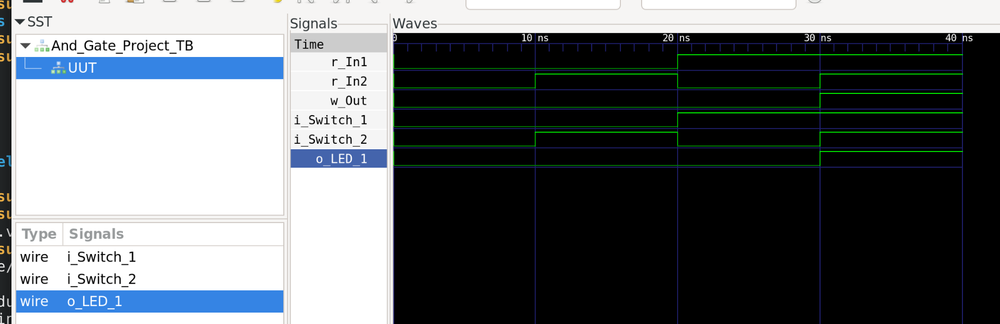

# Chapter Notes

If you are going through the [Getting Started with FPGAs](https://nostarch.com/gettingstartedwithfpgas) book and are following along by using the open source Project iCEStorm flow, I've marked some of the alternatives or notes in here that I encountered while going through the book; hopefully they help you too.

## Chapter 1:

No additional notes required here.

## Chapter 2:

If you are using iceprog to load your bin to your fpga, you shouldn't need to be fiddling with settings, but if you do and need to identify the USB port, it's USB1, *not* USB0, for the nandland go board. This also mentioned in the book (see page 28).

## Chapter 3:

There is a discussion in chapter 3 about a report tool. A similar report can be retrieved from the yosys stat command; in the make build command there is an output that generates a .stat file for you to read. Here's a sample snippet of the yosys stat board that gets you to similar information:

```
=== And_Gate_Project ===

        +----------Local Count, excluding submodules.
        | 
        8 wires
        8 wire bits
        8 public wires
        8 public wire bits
        8 ports
        8 port bits
        1 cells
        1   SB_LUT4

End of script. Logfile hash: b7877c97f5, CPU: user 0.01s system 0.00s, MEM: 13.63 MB peak
```

## Chapter 4:

This chapter talks about a P&R flow print out that talks 1) pin placement and 2) timing. These can be replaced with the --log output from nextpnr, which is already included in the `make build` command and outputs to a *.log file:

```
Info: constrained 'o_LED_2' to bel 'X13/Y7/io0'
Info: constrained 'o_LED_3' to bel 'X13/Y7/io1'
Info: constrained 'o_LED_4' to bel 'X13/Y8/io0'
Info: constrained 'i_Switch_1' to bel 'X13/Y4/io1'
Info: constrained 'i_Switch_2' to bel 'X13/Y3/io1'
Info: constrained 'i_Switch_3' to bel 'X13/Y6/io0'
Info: constrained 'i_Switch_4' to bel 'X13/Y4/io0'

Info: Packing constants..
Info: Packing IOs..
Info: Packing LUT-FFs..
Info:        1 LCs used as LUT4 only
Info:        0 LCs used as LUT4 and DFF
Info: Packing non-LUT FFs..
Info:        0 LCs used as DFF only
Info: Packing carries..
Info:        0 LCs used as CARRY only
Info: Packing indirect carry+LUT pairs...
Info:        0 LUTs merged into carry LCs
Info: Packing RAMs..
Info: Placing PLLs..
Info: Packing special functions..
Info: Packing PLLs..
Info: Promoting globals..
Info: Constraining chains...
Info:        0 LCs used to legalise carry chains.
Info: Checksum: 0xb9179925

Info: Device utilisation:
Info:            ICESTORM_LC:       3/   1280     0%
Info:           ICESTORM_RAM:       0/     16     0%
Info:                  SB_IO:       8/    112     7%
Info:                  SB_GB:       0/      8     0%
Info:           ICESTORM_PLL:       0/      1     0%
Info:            SB_WARMBOOT:       0/      1     0%

Info: Placed 8 cells based on constraints.
Info: Creating initial analytic placement for 1 cells, random placement wirelen = 19.
Info:     at initial placer iter 0, wirelen = 11
Info:     at initial placer iter 1, wirelen = 11
Info:     at initial placer iter 2, wirelen = 11
Info:     at initial placer iter 3, wirelen = 11
Info: Running main analytical placer, max placement attempts per cell = 10000.
Info:     at iteration #1, type ICESTORM_LC: wirelen solved = 11, spread = 11, legal = 14; time = 0.00s
Info:     at iteration #2, type ICESTORM_LC: wirelen solved = 14, spread = 14, legal = 14; time = 0.00s
Info: HeAP Placer Time: 0.00s
Info:   of which solving equations: 0.00s
Info:   of which spreading cells: 0.00s
Info:   of which strict legalisation: 0.00s

Info: Running simulated annealing placer for refinement.
Info:   at iteration #1: temp = 0.000000, timing cost = 0, wirelen = 14
Info:   at iteration #2: temp = 0.000000, timing cost = 0, wirelen = 14 
Info: SA placement time 0.00s

Info: No Fmax available; no interior timing paths found in design.
Info: Checksum: 0xa5cb6749

Info: Routing..
Info: Setting up routing queue.
Info: Routing 6 arcs.
Info:            |   (re-)routed arcs  |   delta    | remaining|       time spent     |
Info:    IterCnt |  w/ripup   wo/ripup |  w/r  wo/r |      arcs| batch(sec) total(sec)|
Info:          6 |        0          6 |    0     6 |         0|       0.00       0.00|
Info: Routing complete.
Info: Router1 time 0.00s
Info: Checksum: 0x22f93c61

Info: Critical path report for cross-domain path '<async>' -> '<async>':
Info:       type curr  total name
Info:     source  0.00  0.00 Source i_Switch_1$sb_io.D_IN_0
Info:    routing  1.49  1.49 Net i_Switch_1$SB_IO_IN (13,4) -> (12,6)
Info:                          Sink o_LED_1_SB_LUT4_O_LC.I3
Info:                          Defined in:
Info:                               src/And_Gate_Project.v:2.9-2.19
Info:      logic  0.31  1.81 Source o_LED_1_SB_LUT4_O_LC.O
Info:    routing  0.59  2.39 Net o_LED_1$SB_IO_OUT (12,6) -> (13,6)
Info:                          Sink o_LED_1$sb_io.D_OUT_0
Info:                          Defined in:
Info:                               src/And_Gate_Project.v:6.10-6.17
Info: 0.31 ns logic, 2.08 ns routing

Info: No Fmax available; no interior timing paths found in design.

Info: Program finished normally.
```

This chapter also discusses the accidental creation of a latch, and the warnings you get. In the book this seems kind of pretty clear: 

```
Latch generated from always block for signal o_Q
```

But in oss tooling, you end up with errors later in the process with regards to timing since you end up creating a combinatorial loop that require knowledge of a prior state. A modified equivalent module was created in the repo (src/Danger_Latch) which, if you run make build on, you'll end up throwing these errors instead:

```
SYNTHESIS:     Running yosys ...
Warning: wire '\o_Segment1_A' is assigned in a block at src/Danger_Latch/Danger_Latch.v:9.7-9.27.
Warning: wire '\o_Segment1_A' is assigned in a block at src/Danger_Latch/Danger_Latch.v:11.7-11.27.
Warning: wire '\o_Segment1_A' is assigned in a block at src/Danger_Latch/Danger_Latch.v:13.7-13.27.
PLACE & ROUTE: Running nextpnr...
ERROR: Timing analysis failed due to combinational loops.
0 warnings, 1 error
```

I think these errors are slightly less clear, but worth demonstrating to see what you should be on the lookout for. 

## Chapter 5:

The alternate to using EDA Playground is using a combination of Icarus Verilog (iverilog) tooling + GTKwave for viewing waveforms. The process in replicating the EDA Playground experience is:

- compiling first with iverilog
- running simulations with verilog virtual processor (VVP); and
- viewing the waveforms generated from the dumpfile produced by vvp (whether automatically or via a directive in your test bench). 

Some notes here:

- I have a `make sim` command that takes the entirety of your testbench (*.sv files - assuming here you are using System Verilog here, as in the book, plus *v files), simulates it, and provides a view of the gtkwave forms if generated. For ease of use the test bench module is simply the name of the project + _TB, e.g., And_Gate_Project should be And_Gate_Project_TB module for the test bench.  
- This is not required in the book, but to make gtkwave easier to read, I've arbitrarily added at the top of the *.v and *.sv files the appropriate `timescale` ranges as needed for the simulation; otherwise gtkwave defaults to seconds. Realistically for your FPGA beginner projects there aren't going to be many things outside of the ns or maybe microsecond range...? For the projects in Chapter 5, though, 1ns/1ns works.
- There are a bunch of ugly warnings for gtkwave if you are using a different version of glibc; don't mind them and in any case I silenced them in the output since they don't impact its use. You can also just install it directly otherwise (very easy).



Regarding the self testbench section: assert statements (as depicted in the code) require the flag -s2005-sv or greater to be used. I used the -s2012 command; it's already part of the `make sim` command; without it, the test bench code won't run. The errors you get on failing an assertion are similar enough to what is published in the book, albeit a little less descriptive:

```
ERROR: src/And_Gate_Project/And_Gate_Project.sv:32: 
       Time: 40  Scope: And_Gate_Project_TB
```

Then on the section of formal verification, the book only lightly touches on it. Not sure which direction you will go in on formal verification when you get to that point, there's [Symbyosys](https://yosyshq.readthedocs.io/en/latest/) (yosys-SMTBMC). But since I am learning Haskell around the same time, there's also [Clash](https://clash-lang.org/) to consider as well.

## Chapter 6

### LSFR Project 

If you've been making *.v files for your builds, you'll run into an error in the Count_and_Toggle along the lines of this:

```
ERROR: In pure Verilog (not SystemVerilog), parameter/localparam with an initializer must use the parameter/localparam keyword
```

The fix for this is simply changing the first line of the book code to denote that the COUNT_LIMIT is a parameter:

```
module Count_And_Toggle #(COUNT_LIMIT = 10)
```

to 

```
module Count_And_Toggle #(parameter COUNT_LIMIT = 10)
```

And then everything should compile normally. It might be a typo; the later implementations described in the chapter (e.g., RAM_2Port) use parameter.

### RAM_2Port & FIFO

For RAM_2Port & FIFO, timescale 1ns/1ns was added for the testbenches (these are the ones lifted directly from the [repo](https://github.com/nandland/getting-started-with-fpgas) since they are not in the book.)

## Chapter 7

No comment for this chapter - think this section is more a review at this point if you're already using all these separate OSS tools.

## Chapter 8

No comment for this chapter - although it is not discussed in the book, looking at the waveform generated for the turnstile project is very useful at understanding the states. 

The memory game is really cool :)

## Chapter 9

No comment for this chapter; like 7, it's largely meant to be informative.

## Chapter 10

No comment for this chapter; like 7 and 9; it's meant to be informative.

## Chapter 11

No comment for this chapter; like prior informative chapters, not much additional comment to add. 

## And Beyond

The book ends at chapter 11 and has an appendix about getting into the field, but there are additional projects on the nandland go page, which I'll cover here. The projects that are notable are from 7 onward: UART and VGA, both of which are handy to do with the nandland go board because it comes with UART and a VGA output (the latter which you would've needed a PMOD otherwise on a diff board). So without further ado:

## Project 7: UART Receiver, Part 1

https://nandland.com/project-7-uart-part-1-receive-data-from-computer/

It is not too obvious on how to send data to the FPGA based on the tutorial, at least to a newcomer; randomly mashing keys on the keyboard won't work right out of the box. The information needed to be able to mash buttons is in the UART Configuration Parameters:

```
Baud Rate            (9600, 19200, 115200, others)
Number of Data Bits  (7, 8)
Parity Bit           (On, Off)
Stop Bits            (0, 1, 2)
Flow Control         (None, On, Hardware)
```

I use `screen` here because it's pretty straightforward, but I think you can use any simple terminal to be able to send data directly to your board:

```
screen /dev/ttyUSB1 115200
// now start mashing buttons
```

As noted above in Chapter 2, it's USB1, not 0, for the nandland go board. 

## Project 8: UART Receiver, Part 2

https://nandland.com/project-8-uart-part-2-transmit-data-to-computer/

There is a bug in the Top file since the UART_TX constructor requires an i_Rst_L to be defined before the i_Clock that isn't specified in the Top file on the page. As noted in the comments on the page, you can just add it in to the Top file and directly just set the bit to 1 if you don't care about resetting:

```
  UART_TX #(.CLKS_PER_BIT(217)) UART_TX_Inst
  (.i_Rst_L(1'b1),
   .i_Clock(i_Clk),
   .i_TX_DV(w_RX_DV),    
   .i_TX_Byte(w_RX_Byte), 
   .o_TX_Active(w_TX_Active),
   .o_TX_Serial(w_TX_Serial),
   .o_TX_Done());
```

Not mentioned in the comments but good to also do: set the i_Rst_L in the UART_Loopback test bench, since it's also not set there (????), as well as  init the w_RX_DV; adding the below two lines to the testbench silences all the annoying warnings when you try to simulate it. 

```
  reg r_Rst_L = 1; // TX has this defined before the clock
  wire w_RX_DV;
```

I also took out the include in the test bench, because if you're already including all the *.sv and *.v files in the project this is not necessary. I also addeded `timescale 1ns/1ns to everything to also silence the warnings from simulation.
